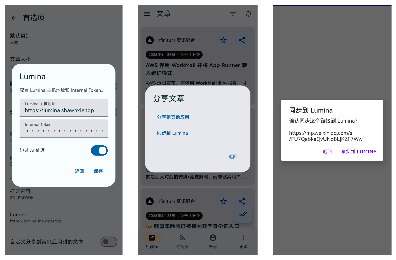

# ReadropsForLumina

ReadropsForLumina 是基于 [Readrops](https://github.com/readrops/Readrops) 修改的 Android RSS 阅读器，保留原项目的多服务 RSS 阅读能力，并增加了面向 [Lumina](https://github.com/shawnxie94/lumina) 的文章同步入口。

本项目适合希望继续使用 RSS 工作流，同时把文章链接或网页内容沉淀到 Lumina 知识库中的用户。

## 主要特性

- 本地 RSS 解析，支持 RSS 1.0、RSS 2.0、Atom、JSON Feed。
- 支持 FreshRSS、Nextcloud News、Fever API、Google Reader API 等外部服务。
- 支持多账号、订阅源管理、文件夹管理、OPML 导入导出。
- 支持后台同步、新文章通知、收藏、已读状态、文章本地阅读视图。
- 文章详情页和文章列表摘要支持 Markdown 内容渲染。

  

## Lumina 集成

- 在文章分享菜单中提供“同步到 Lumina”入口。
- 支持从其他应用分享链接到 ReadropsForLumina 后同步到 Lumina。
- 针对微信公众号链接，支持在 ReadropsForLumina 内打开网页并上传页面内容。
- 支持配置 Lumina API 地址、Internal Token 和 skip_ai_processing。
- 同步前有二次确认，避免误操作。
- 同步结果会提示成功、重复、配置缺失或接口错误。



## 发布包

正式版本通过 GitHub tag 触发发布流程。应用内显示的版本号来自构建时的 tag，例如 `v0.0.1`。

Release APK 会发布在本仓库的 GitHub Releases 中：

```text
https://github.com/shawnxie94/readrops-lumina/releases
```

## 本地开发

开发环境需要 Android SDK、JDK 17 和 Gradle。常用验证命令：

```bash
./gradlew :api:testDebugUnitTest :app:testDebugUnitTest
./gradlew :app:assembleDebug
./gradlew :app:assembleBeta
./gradlew :app:assembleRelease
```

如果只是本机安装测试并希望 APK 体积接近正式包，优先使用 `:app:assembleBeta` 生成的 `app/build/outputs/apk/beta/app-beta.apk`。`debug` 包不会做 R8 压缩和资源裁剪，体积会明显大于 beta/release。

调试账号可以在 `local.properties` 中配置，用于自动填充登录表单：

```properties
debug.<account_type>.login=<login>
debug.<account_type>.password=<password>
debug.<account_type>.url=https\://<your_instance>

# Example:
debug.nextcloud_news.login=Test user
debug.nextcloud_news.password=1234
debug.nextcloud_news.url=https\://rss.example.com
```

## 开源协议

GPLv3 协议
